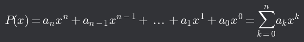
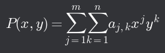
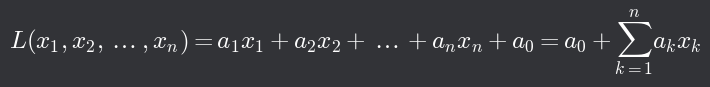

# Vektorový prostor

## Definice

- Definujeme vektorový prostor _V_ = (_M_, ⊕, ⊗) nad tělesem _T_
  - Prvky z _M_ nazáváme vektory
  - Prvky z _T_ nazýváme skaláry
  - ⊕ je zobrazení _M_ × _M_ → _M_
  - ⊗ je zobrazení _T_ × _M_ → _M_
- Vektorový prostor musí splňovat 10 axiomů:
  1. **_D_(⊕) = _M_ × _M_** => Ke každé dvojici vektorů existuje jejich součet, který je také vektorem
  2. **_a_ ⊕ _b_ = _b_ ⊕ _a_** pro ∀(a,b) ∈ _M_ × _M_ => komutativita
  3. **(_a_ ⊕ _b_) ⊕ _c_ = _a_ ⊕ (_b_ ⊕ _c_)** pro ∀(a,b,c) ∈ _M_ × _M_ × _M_ => asociativita
  4. **_a_ ⊕ _o_ = _a_** ∃! _o_ ∈ _M_ pro ∀ _a_ ∈ _M_ => existence nulového vektoru
  5. **_a_ ⊕ (-_a_) = _o_** ∃ (-_a_) ∈ _M_ pro ∀ _a_ ∈ _M_ => existence opačného vektoru; výsledkem je nulová vektor nikoli nula (skalár)
  6. **_D_(⊗) = _T_ × _M_** => Ke každému číslu a vektoru existuje příslušný násobek vektoru, která je také vektorem
  7. **1 ⊗ _a_ = _a_** pro ∀ _a_ ∈ _M_
  8. **α ⊗ (β ⊗ _a_) = (α × β) ⊗ _a_** pro ∀ (α, β, _a_) ∈ _T_ × _T_ × _M_
  9. **α ⊗ (_a_ ⊗ _b_) = α ⊗ _a_ ⊕ α ⊗ _b_** pro ∀ (α, _a_, _b_) ∈ _T_ × _M_ × _M_
  10. **(α + β) ⊗ _a_ = α ⊗ _a_ ⊕ β ⊗ _a_** pro ∀ (α, β, _a_) ∈ _T_ × _T_ × _M_
- Dále platí:
  - 0 ⊗ _a_ = _o_
  - (-1) ⊗ _a_ = (-_a_)

## Podprostor

- Je-li _V_ = (_M_, ⊕, ⊗) vektorový prostor na tělesem _T_, nazveme _U_ = (N, ⊕, ⊗) podprostorem vektorového prostoru _V_, pokud množina _N_ ⊂ _M_ splňuje:
  - ⊕ je zobrazení _N_ × _N_ → _N_
  - ⊗ je zobrazení _T_ × _N_ → _N_
- Zapisujeme _U_ ⊂ _V_
- Číselné těleso _T_ je automaticky společné
- Podprostor vektorového prostoru je sám o sobě vektorovým prostorem

## Nejběžnější vektorové prostory

- Geometrické vektorové prostory
  - Množiny orientovabých úseček na přímce, vrovině nebo v prostoru
- Aritmetické vektory
  - _Tn_ - množina _n_-tic čísel z tělesa _T_ (např.: ℝ2)
  - (_a1_, _a2_, _a3_, ..., _an_) ⊕ (_b1_, _b2_, _b3_, ..., _bn_) = (_a1_ + _b1_, _a2_ + _b2_, _a3_ + _b3_, ..., _an_ + _bn_)
  - α ⊗ (_a1_, _a2_, _a3_, ..., _an_) = (α×*a1*, α×*a2*, α×*a3*, ..., α×*an*)
- Mnohočleny jedné proměnné
  - Jako mnohočleny jedné proměnné definujeme zobrazení, které každému _x_ přiřazují hodnotu:
  - 
  - Nejvyšší hodnota _k_, pro kterou _ak_ ≠ 0, označujeme jako stupeň mnohočlenu
    - Každý mnohočlen stupně _k_ > 0 má nejvýše _k_ různých komplexních kořenů
  - _Pn_ - množina mnohočlenů jedné proměnné nejvýše _n_-tého stupně s koeficienty z tělesa _T_
  - (P ⊕ Q)(x) = (aₙ + bₙ) xⁿ + (aₙ₋₁ + bₙ₋₁) xⁿ⁻¹ + ... + (a₁ + b₁) x + (a₀ + b₀)
    - P(x) = aₙ xⁿ + aₙ₋₁ xⁿ⁻¹ + ... + a₁ x + a₀
    - Q(x) = bₙ xⁿ + bₙ₋₁ xⁿ⁻¹ + ... + b₁ x + b₀
  - (α ⊗ P)(x) = (α ⋅ aₙ) xⁿ + (α ⋅ aₙ₋₁) xⁿ⁻¹ + ... + (α ⋅ a₁) x + (α ⋅ a₀)
  - Omezení stupně není nutn
- Mnohočleny dvou proměnných
  - 
  - Stupněm takového polynomu je hodnota součtu _j_+_k_, pro kterou existuje nenulové _j_ a _k_
  - Zavedením sčítání a násobení číslem podobně jako u mnohočelnů jedné proměnné získáme opět vektorový prostor (omezení stupně opět není nutné)
- Lineární mnohočly více proměnných
  - Mnohočleny více proměnných nejvýše prvního stupně (také nazýváno lineární funkce více proměnných)
  - 
  - Zavedení sčítání a násobení číslem opět podobné jako u mnohočlenů jedné proměnné
  - Počet proměnných pro lineární funkce je pevný
- Funkční prostory
  - Množina všech funkcí se stejným definičním oborem a hodnotami ze stejného tělesa tvoří vektorový prostor
  - (_f_ ⊕ _g_)(_x_) = _f(x)_ + _g(x)_
  - (α ⊗ _f_)(_x_) = α ⋅ _f(x)_
- Omezené funkce
  - Omezená funkce _f_ je funkce taková, že existuje číslo _cf_ takové, že |_f(x)_| ≤ _cf_
  - |(_f_ ⊕ _g_)(_x_)| ≤ _cf_ + _cg_
- Kladné funkce
  - _f(x)_ > 0
  - Při běžněm zavedení operací není vektorovým prostorem (absence nulového a opačného prvku)
  - Můžeme ale zavést operace jako:
    - (_f_ ⊕ _g_)(_x_) = _f(x)_ ⋅ _g(x)_
    - (α ⊗ _f_)(_x_) = [*f(x)*]ᵅ
- Rovnice
  - Rovnice _f(x)_ = b
    - tvoří-li možné funkce na levé straně vektorový prostor s "přirozeně" zavedeným sčítáním a násobením, můžeme tyto operace zavést i pro celé rovnice
  - _R_ : _f(x)_ = _a_
  - _S_ : _g(x)_ = _b_
  - _R_ ⊕ _S_ = rovnice _f(x)_ ⊕ _g(x)_ = _a_ + _b_
  - α ⊗ _R_ = rovnice α ⊗ _f(x)_ = α ⋅ _a_

[Zobrazení ⬅️](./01_zobrazeni.md) | [➡️ Lineární kombinace vektorů](./03_LinearniKombinaceVektoru.md)
