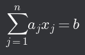

# Soustavy lineárních rovnic

## Rovnice s _n_ neznámými

- _f_(_x₁_, _x₂_, ..., _xₙ_) = _b_
- Požadujeme, aby funkce _f_ náležela do vektorového prostoru _VD_ (nad tělesem _T_) funkcí definovaných na množině _D_, ve kterém jsou standardně definované operace pro všechny _n_-tice (_x1_, _x2_, ..., _xn_) z _D_:
  - (_f_ ⊕ _g_)(_x1_, _x2_, ..., _xn_) = _f_(_x1_, _x2_, ..., _xn_) + _g_(_x1_, _x2_, ..., _xn_)
  - (α ⊗ _f_)(_x1_, _x2_, ..., _xn_) = α ⋅ _f_(_x1_, _x2_, ..., _xn_)
- Pro rovnice můžeme zavést sčítání a násobení číslem z _T_
  - _r_ = (_f_(_x1_, _x2_, ..., _xn_) = _b_)
  - _s_ = (_g_(_x1_, _x2_, ..., _xn_) = _d_)
  - _r_ ⊕ _s_ = (_f_(_x1_, _x2_, ..., _xn_) + _g_(_x1_, _x2_, ..., _xn_) = _b_ + _d_)
  - α ⊗ _r_ = (α ⋅ _f_(_x1_, _x2_, ..., _xn_) = α ⋅ _b_)
- Množina rovnic o _n_ neznámých s funkcemi z prostoru _VD_ a takto definovanými operacemi tvoří vektorový prostor

## Soustavy rovnic

- Konečnou množinu rovnic _R_ = {_r₁_, _r₂_, ..., _rₘ_}, kde ri = (_fᵢ_(_x₁_, _x₂_, ..., _xₙ_) = _bᵢ_) nazveme soustava rovnic o _n_ neznámých
- Řešením soustavy je každá _n_-tice, která je řešením všech rovnic
- Pokud je _n_-tice řešením všech rovnic _R_, pak je i řešením jakékoli lineární kombinace rovnic z _R_
- Jsou-li _R_ a _S_ soustavy rovnic o _n_ neznámých pro funkce z prostoru _VD_ a span(_R_) = span(_S_), pak mají stejnou množinu řešení

## Lineární rovnice s _n_ neznámými

- _a_1_x_1 + _a_2_x_2 + ... + _a_n_x_n = _b_
  - _aj_ -> koeficienty rovnice
  - _xj_ -> neznámé v rovnici
  - _b_ -> pravá strana rovnice
  - Na levé straně rovnice se nacházejí ryze lineární funkce _n_ proměnných

## Izomorfismus

- Jsou-li _U_=(_M_, ⊕ᵤ, ⊗ᵤ) a _V_=(_N_, ⊕ᵥ, ⊗ᵥ) vektorové prostory nad stejným tělesem a existuje _I_ : _M_ → _N_ [*D(I)* = *M* a *W(I)* = *N*]
  - _I_(_a_ ⊕ᵤ _b_) = _I(a)_ ⊕ᵥ _I(b)_
  - _I_(α ⊗ᵤ _a_) = α ⊗ᵥ _I(a)_
- Pak řekneme, že prostory _U_ a _V_ jsou izomorfní a zobrazení _I_ je jejich izomorfismem
- Podtstate je, že nezáleží na tom v jakém z prostorů provádíme operace
  - Můžeme "přeložit" úlohu z jednoho prostoru do druhého (kde se nám lépe pracuje) a poté provést "zpětný překlad"
- Zobrazení, které rovnici _a₁x₁_ + _a₂x₂_ + ... _aₙxₙ_ = _b_ přiřadí (_n_+1)-tici čísel (_a₁_ + _a₂_ + ... _aₙ_, _b_) je izomorfismem prostoru lineárních rovnic o _n_ neznámých s prostorem _T_n+1

## Řešení soustav pomocí Gaussovy eliminace

- Soustavu rovnic tedy můžeme "přeložit" na soustavu (n+1)-tic a s nimi provádět gaussovské operace (které nezmění lineární obal)
- (n+1)-tice upravíme do příjemnější podoby, jelikož se lineární obal nezměnil, upravená (n+1)-tice má stejnou množinu řešení jako původní (n+1)-tice
- Soustavy se řeší vepsáním (n+1)-tic do matice

[Lineární kombinace vektorů ⬅️](./03_LinearniKombinaceVektoru.md) | [➡️ Lineární závislost vektorů](./05_LinearniZavislostVektoru.md)
