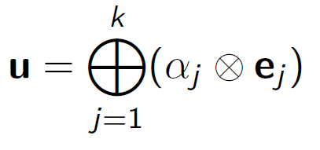

# Lineární závislost vektorů

## Lineární závislost

- Množina vektorů _A_ = {_a₁_, _a₂_, (...)} je lineárně závislá, pokud existuje vektor aⱼ ∈ A, který je lineární kombinací _ostatních_ vektorů z _A_
- Množina je lineárně nezávislá nedají-li se všechny vektory vyjádřit lineární kombinací ostatních
- Lineárně závislá množina _A_ <=> netriviální lineární kombinace jejích vektorů dá nulový vektor
- Lineární nezávislá množina _A_ <=> jediná lineární kombinace dávající nulový vektor je triviální (nulové koeficienty)
- množina obsahující nulový a další vektor je lineárně závislá

## Baze vektorového prostoru

- Je-li _V_=(_M_, ⊕, ⊗) vektorový prostor a _A_ ⊂ _M_ taková **lineárně nezávislá** množina, že span(_A_) = _M_, nazveme _A_ **bazí** prostoru _V_
  - _A_ je bazí prostoru _V_ pokud je každý vektor z množiny*M* dosažitelný lineární kombinací z množiny _A_ a zároveň jsou vektory z množiny _A_ lineárně nezávislé
- Baze je uspořádaná -> záleží na pořadí
- Nejobvyklešní baze se označují za kanonické
  - př. v prostoru ℝ³ by se jednalo o vektory {(1,0,0); (0,1,0); (0,0,1)}

## Dimenze vektorového prostoru

- **Steinitzova věta**: Každé dvě (=> všechny) baze téhož vektorového prostoru mají stejný počet prvků
  - Počet prvků je vlastností prostoru = dimenze (rozměr) vektorového prostoru
- Pokud baze neexistuje pak dim(_V_) = ∞

## Souřadnice vektoru v bazi

- Je-li _E_={_ej_} baze vektorového prostoru _V_ = (_M_, ⊕, ⊗) a vektor _u_ ∈ _M_, pak jsou koeficienty této lineární kombinace jednoznačné:
- 
- Koeficienty této lineární kombinace nazveme souřadnicemi vektoru _u_ v bazi _E_
- Týž vektor má v různých bazích různé souřadnice
- Pro _V_=(_M_, ⊕, ⊗) nad tělesem _T_ s bazí _E_, kde dim(_V_)=_n_:
  - Pro souřadnice vektoru _w_ = _u_ ⊕ _v_ v bazi _E_ platí _wᴱ_ = _uᴱ_ ⊕ _vᴱ_ ve smyslu sčítání vektorů z _Tⁿ_
  - Pro souřadnice vektoru _w_ = α ⊗ _u_ v bazi _E_ platí _wᴱ_ = α ⊗ _uᴱ_ ve smyslu násobku vektoru z _Tⁿ_

### Souřadnice vektoru jako vektor

- Souřadnice součtu vektorů dostaneme sčítáním souřadnic jednotlivých vektorů
- Souřadnice násobku vektoru dostaneme násobkem souřadnic vektoru (vše musí být ve stejné bazi, bez ohledu na původní vektorový prostor)
  - Je-li v _n_-rozměrném prostoru _V_ k dispozici baze, můžeme práci s vektory z prostoru _V_ nahradit prací s _n_-ticemi čísel
  - Prostory _V_ nad _T_ kde dim(_V_) = _n_ a prostory *Tn*jsou izomorfní
  - Každé dva prostory nad stejným tělesem a se stejnou konečnou dimenzí jsou navzájem izomorfní

### Přiřazení souřadnic a vektorů

- Zobrazení přiřazující vektorům souřadnice v určité bazi jsou prostá
  - Souřadnice vektoru _u_ v bazi _E_ značíme _uE_
- Díky prostotě existují inverzní zobrazení, která souřadnicím v dané bazi přiřazují vektory
- Přiřazení souřadnic k vektoru _u_ v bazi _E_ značíme jako s*E* a přiřazení vektoru k souřadnicím jako v*E*(_uE_)
  - _uE_ = s*E*(_u_)
  - _u_ = v*E*(_uE_)

[Soustavy lineárních rovnic ⬅️](./04_SoustavyLinearnichRovnic.md) | [➡️ Číselné matice a operace s nimi](./06_CiselneMatice.md)
