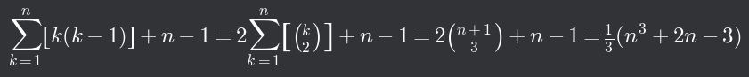
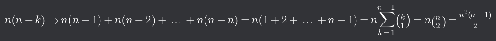
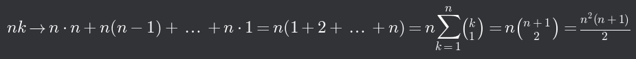
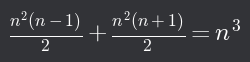
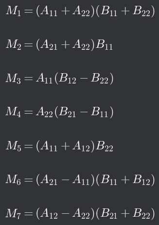
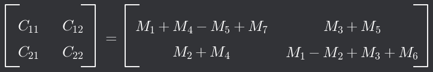

# Výpočetní náročnost operací s maticemi

## Výpočty

- Kalkulátory neobsahují paměť s tabulkami, to by zabíralo příliš mnoho místa
  - Hodnoty funkcí se tedy počítají pomocí jejich(dostatečně přesného) přiblížení na mnohočleny

## Výpočty ve dvojkové soustavě

- Nejjednodušší operací je sčítání
- Násobení jednou cifrou je velmi efektivní (násobíme 1 nebo 0)
  - Násobení je tedy převedeno na součet maximálně tolika prvků, kolikaciferná čísla používáme
  - V desítkové soustavě musí být k dispozici tabulka malé násobilky
- Dělení vyžaduje tolik odečítání a porovnání typu _a_ > _b_, kolik má mít výsledek cifer
  - Považuje se tedy stejně náročné jako násobení (ve dvojkové soustavě)
- V porovnání s násobením a dělením můžeme nákladnost sčítání a odečítání zanedbat (zadarmo)
  - Jako jednotku nákladnosti ve výpočtech lineární algebry tedy považujeme jedno násobení/dělení

## Jednoduché operace

- operace bez násobení
  - Sčítání matic
  - Transpozice
- Násobení vektoru/matice jedním číslem -> náročnost je rovna počtu prvků vektoru/matice

## Násobení matice vektorem

- Násobení matice *m*×*n* _n_-složkovým vektorem
- Při výpočtu každé složky vektoru se musí provést _n_ násobení a výsledný vektor má _m_ složek
- => Náročnost je _m_ ⋅ _n_, stejně jako konstantní násobek matice (sčítání je zadarmo)

## Násobení matic

- Násobení matice _A_ *m*×*n* maticí _B_ *n*×*p*
- Sloupce vásledné matice *m*×*p* jsou součiny řádků matice _A_ se sloupci matice _B_
- => náročnost je _m_ ⋅ _n_ ⋅ _p_
  - Pro čtvercové matice *n*×*n* dostaneme náročnost _n_3
  - Násobení matice vektorem lze tedy chápat jako _m_ ⋅ _n_ ⋅ 1

## Násobení součinu matic vektorem

- (_AB_)_u_ má náročnost _m_ ⋅ _n_ ⋅ _p_ + _m_ ⋅ _p_ = _m_ ⋅ _p_ ⋅ (_n_ + 1)
- _A_(_Bu_) má náročnost _n_ ⋅ _p_ + _m_ ⋅ _n_ = _n_ ⋅ (_m_ + _p_)
- => předběžné násobení matic je nevýhodné

## Výpočet determinantu pomocí Gaussovy eliminace

- Jsou-li už v matici nulami nahrazeny poddiagonální prvky v prvních (_n_ - _k_) sloupcích, pro vynulování prvnů v prvním sloupci submatice _k_ × _k_ potřebujeme:
  - Najít koeficientyy, kterými budeme násobit prvky prvního řádku submatice -> jedno dělení
  - Zbývajícívh (_k_ - 1) prvků koeficientem vynásobit -> (_k_ - 1) násobení
- Celkem tedy _k_ operací na jeden řádek submatice a _k_(_k_ - 1) operací na všechny řádky (první řádek, kde hledáme koeficienty, nenulujeme)
- Toto se musí provést pro všechny sloupce matice *n*×*n*
- Ještě musíme přičíst (_n_ - 1) -> počet násobení diagonálních prvků (pro výpočet determinantu)
- 
- Náročnost GEM bez výpočtu determinantu je pak ⅓(_n_3 - _n_)

## Výpočet inverzní matice pomocí Gaussovy-Jordanovy eliminace

- Náročnost nulování pod diagonálou
  - pro jeden řádek potřebujeme _n_ operací, všech zbývajících _n_ - _k_ řádků tedy _n_(_n_ - _k_) operací
  - 
- Náročnost zpětného chodu
  - Pro _k_ - 1 řádků potřebujeme _n_(_k_ - 1) = _nk_ - _n_ operací, včetně jedničky na diagonále pak _nk_ operací
  - 
- Celková náročnost tedy je _n_3
  - 

## Strassenův algoritmus

- Algoritmus používáný pro násobení matic
- Rychlejší než klasický multiplikační algoritmus a používá se na matice vysokých řádů
- publikován roku 1969
- Při výpočtu součinu matic 2×2 vypočítáme součiny
  - 
- a součty
  - 
- V klasickém algoritmu potřebujeme 8 násobení, zde jen 7
- Síla algoritmu se projeví při násobení blokových matic
  - např. matici 4×4 rozdělíme na 4 bloky 2×2, pro násobení bloků potřebujeme provést 7 součinů a na každý z těchto součinů potřebujeme opět 7 součinů
  - 72 = 49 operací místo klasických 43=64
- Klasický algoritmus má rychlost nlog2(8)=n3, tento má nlog2(7)≈n2,807

[Číselné matice a operace s nimi⬅️](./06_CiselneMatice.md) | [➡️ Lineární zobrazení na vektorových prostorech](./08_LinZobrazVektProst.md)
