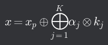

# Frobeniova věta

- Je-li _f_ : _U_=(_M_, ⊕ᵤ, ⊗ᵤ) → _V_=(_N_, ⊕ᵥ, ⊗ᵥ) lineární zobrazení, pak pro řešení rovnice _f(x)_ = _b_ (pro _b_ ∈ _N_) platí:
  1. Řešení existuje, pokud _b_ ∈ _W(f)_
  2. Je-li _f(x)_ = _b_ (pro _b_ ∈ _W(f)_ a _x_ ∈ _M_), pak _f(y)_ = _b_, právě když existuje _k_ ∈ ker(_f_) takové, že _y_ = _x_ ⊕ᵤ _k_
     1. _x_ a _y_ se liší o nenulový vektor _k_, jehož obrazem ale nulový vektor je (protože _k_ je součástí jádra zobrazení)
     2. Pokud kr(_f_) = {o}, pak je lineární zabrazení _f_ prosté
- Postup řešení rovnice _f(x)_ = _b_ (hledáme vzor _x_)
  1. Najdeme jádro zobrazení _f_ a nějakou jeho bazi _K_={_k₁_, _k₂_, ..., _kK_}
  2. Najdeme partikulární řešení: nějaké _xp_, kde _f(xp)_ = _b_
  3. Řešení: {_x_=_xp_ + libovolná lineární kombinace vektorů baze jádra}

- Pro libovolnou sadu koeficientů α ∈ _T_
- **dom(_D(f)_) = dim(_W(f)_) + dim(ker(_f_))**

## Souvislost s řešením soustav lineárních rovnic

- Je-li _A_ matice *m*×*n*, _b_ ∈ _Tm_ a _x_ ∈ _Tn_
  - Je násobení _A_ krát _x_ lineární zobrazení _Tm_ → _Tn_
  - Rovnice _Ax_=_b_ je soustavou lineárních rovnic pro _n_ neznámých složek vektoru _x_
- Pokud nám řešení rovnice nevyjde jednoznačně, musíme zvolit neznámé jako parametry, pak bude výsledkem část neobsahující parametry a další část pro každý parametr
  - Řešením nehomogenní rovnice dostaneme stejný výsledek až na část obsahující parametry a další část pro každý parametr
  - Část obsahující parametry je tedy jádrem soustavy a vektor bez parametrů je partikulárním řešením

[Lineární zobrazení vektorového prostoru ⬅️](./08_LinZobrazVektProst.md) | [➡️ Maticová reprezentace zobrazení](./10_MaticovaReprezentaceZobrazeni.md)
