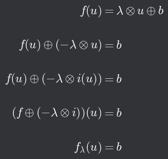
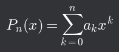
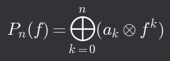
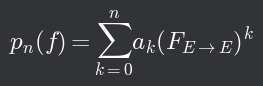

# Zobrazení prostoru do sebe

## Lineární zobrazení vektorového prostoru do sebe

- Pokud U=(M, ⊕, ⊗) je vektorový prostor, můžeme uvažovat i o zobrazeních z množiny M znovu do množiny M
  - f: U→U
  - Nazýváme (lineární) zobrazení vektorového prostoru do sebe nebo také (lineární) endomorfismus na prostoru U
- Endomorfismy nám umožňují aplikovat zobrazení opakovaně f(f()) a můžeme porovnávat jejich vzory a obrazy přímo pomocí vektorových operací ⊕, ⊗
  - Můžeme si klást otázku, jaké musí být vektory u, b a číslo λ, aby f(u) = λ ⊗ u ⊕ b

## Vlastní vektory a vlastní čísla

- Je-li f lineární endomorfismus na U=(M, ⊕, ⊗) nad tělesem T, pak řekneme, že u je vlastní vektor zobrazení f, pokud u ≠ o a existuje λ ∈ T taková, že f(u) = λ ⊗ u
  - Vlastní vektor zobrazení f je takový nenulový vektor, který se zobrazí na svůj násobek
  - λ je pak vlastní číslo (vlastní hodnota) zobrazení f
  - Vlastní čísla pro různé vektory mohou být různá
  - Nulový vektor se za vlastní nepovažuje, skalár nula ale **může** být vlastním číslem
- Množina vlastních vektorů s odlišnými vlastními čísly je lineárně nezávislá
  - Nezávislá zůstane i po přidání hlavních vektorů

## Hlavní vektory

- Je-li f lineární endomorfismus na U=(M, ⊕, ⊗) nad tělesem T s vlastním číslem λ a vlastním vektorem u⁽⁰⁾, nazveme hlavním vektorem zobrazení f řádu k vektor u⁽ᵏ⁾ takový, že f(u⁽ᵏ⁾) = λ ⊗ u⁽ᵏ⁾ ⊕ u⁽ᵏ⁻¹⁾
  - Hlavní vektor 1. řádu u(1) se zobrazíé na součet svého násobku s vlastním vektorem u(0)

## Vlastní podprostor

- Všechny vlastní vektory lineárního endomorfismu f : U → U se společným vlastním číslem λ, doplněné o nulový vektor, tvoří podprostor v U
  - Ten nazýváme vlastní podprostor zobrazení f s vlastním číslem λ

## Vlastní vektory a čísla matic

- Vztah f(u) = λ ⊗ u je ekvivalentní vztahu pro souřadnice FE→E ⋅ uᴱ = λ ⋅ uᴱ
- Zobrazení fλ je reprezentováno maticí Fλ = F - λ ⋅ E (E = jednotková matice), tato matice nemá plnou hosdnost

## Opakované skládání

- Endomorfismy (ne nutně lineární) můžeme skládat samy se sebou
  - Vytvořená zobrazení nazýváme _n_-tými mocninami zobrazení f
  - **f⁰ = i (identita)**
  - **fⁿ = f(fⁿ⁻¹)** pro každé n ∈ ℤ
  - fᵐ(fⁿ) = fᵐ⁺ⁿ
  - (fᵐ)ⁿ = fᵐⁿ
  - f⁻ⁿ = (f⁻¹)ⁿ
- Složené zobrazení se reprezentuje součinem matic, mocnina zobrazení je proto reprezentována mocninou matice fn=(FE→E)n
- Má-li f vlastní vektor u s vlastním číslem λ, pak fn má stejný vlastní vektor u s vlastním číslem λn

## Lineární kombinace mocnin

- Pro endomorfismus na U=(M, ⊕, ⊗) nad T a mnohočlen

s koeficienty z tělesa _T_ definujeme mnohočlen _Pn_ ze zobrazení f jako zobrazení:

- Pro matice

- násobení matic, které vznikly jako mnohočlen téže matice, je komutativní
- Má-li f vlastní vektor u s vlastním číslem λ, pak _Pn(f)_ má stejný vlastní vektor u s vlastním číslem _Pn(λ)_

[Maticová reprezentace lineárního zobrazení ⬅️](./10_MaticovaReprezentaceZobrazeni.md) | [➡️ Determinant](./12_Determinant.md)
