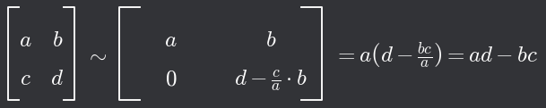
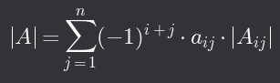

# Determinant

## Determinant lineárního zobrazení

- U (lineárního) endomorfismu _f_ patří vzory i obrazy do stejné množiny, můžeme je tedy navzájem porovnávat
- Nemusíme se zabývat jednotlivými vektory, můžeme např. porovnávat vztahy mezi množinou _Ω_ a _f_(_Ω_)
  - _f(Ω)_ nazýváme obrazem množiny _Ω_
  - _f(Ω)_ = {v = _f(u)_; _u_ ∈ _Ω_}
- Poměr velikostí množiny Ω a f(Ω) u lineárního endomorfismu je vždy stejný pro všechny množiny Ω
  - Tento poměr nazýváme determinantem lineárního zobrazení
  - Značíme det(_f_)
  - Pro každou množinu vektorů _Ω_ je **_μ(f(Ω))_ = det(_f_) ⋅ _μ(Ω)_**
- Determinant složeného zobrazení je součinem determinantů
  - de(_g(f)_) = det(_g_)⋅det(_f_)

## Determinant matice

- Zaveden ve čtvercových maticích
- Determinantem čtvercové matice řádu _n_ se nazývá součet všech součinů _n_ prvků této maticetakových, že v žádném z uvedených součinů se nevyskytují dva prvky z téhož řádku ani téhož sloupce
  - v každém součinu je každý řádek i sloupec matice zastoupen právě jedním prvkem
  - každý součin je navíc označen paritou permutace
- Všechny matice, které reprezentují totéž zobrazení v různých bazích, mají determinanty stejné
- |_F_| = 0 <=> ker(_f_) ≠ {o}
  - Pokud je determinant matice _F_ roven 0, pak je jádro zobrazení _f_ netriviální (nenulové) a matice je singulární

## Metody výpočtu

- K výpočtu determinantu můžeme použít GEM/Sarrusovo pravidlo/rozvoj podle řádku (sloupce)

### GEM

- Má-li matice pod diagonálou (nebo nad ní) samé nuly, je determinant roven součinu jejích prvků na diagonále
- |_A_ ⋅ _B_| = |_A_| ⋅ |_B_|
- Násobení gaussovskými maticemi může ovlivnit hodnotu determinantu
  - Při výměně řádků matice se mění znaménko determinantu
  - Přičtením násobku jednoho řádku k jinému řádku se determinant nemění
  - Pokud násobíme nějaký řádek číslem (a není to pouze s účelem přičtení tohot násobku k jinému řádku), determinant je také vynásoben tímto číslem (při dělení vydělen)
    - pro zachování hodnoty determinantu původní matice je třeba provést s determinantem nové matice opačnou operaci

### Sarrusovo pravidlo

- Determinant matice 3×3 lze dokázat podobně (= aei + dhc + bfg - ceg - bdi - fha)
- Sarrusovo pravidlo je pouze mnemotechnická pomůcka, s jejíž pomocí si můžeme odvodit "základní" permutační vzorec pro výpočet determinantu, a funguje pouze pro matice 2×2 a 3\*3

### Rozvoj podle řádku (sloupce)

[Zobrazení prostoru do sebe ⬅️](./11_ZobrazeniProstoruDoSebe.md) | [➡️ Skalární součin](./13_SkalarniSoucin.md)
