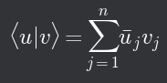
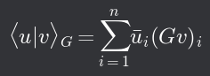
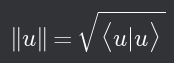
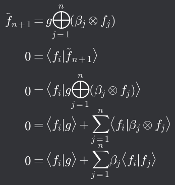
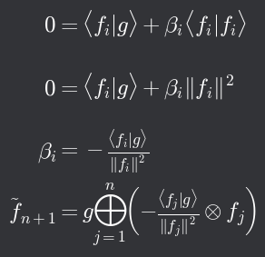

# Skalární součin

## Skalární součin

- Je-li _V_=(_M_, ⊕, ⊗) vektorový prostor nad tělesem _T_ a je definováno zobrazení _M_ x _M_ → _T_ (značíme ⟨ ⋅ | ⋅ ⟩) s těmito vlastnostmi: (pro ∀ _u_, _v_, _w_ ∈ _M_; ∀ α ∈ _T_)
  1. ⟨_u_|_v_ ⊕ _w_⟩ = ⟨_u_|_v_⟩ + ⟨_u_|_w_⟩
  2. ⟨_u_|α ⊗ _v_⟩ = α ⋅ ⟨_u_|_v_⟩
  3. ⟨_u_|_v_⟩ = ⟨_v_|_u_⟩
     1. Platí v reálných prostorech, v komplexních je prohození komplexně sdružené
  4. ⟨_u_|_u_⟩ ≥ 0
     1. ⟨_u_|_u_⟩ = 0 ⟺ _u_ = _o_
- Nazveme hodnotu ⟨_u_|_v_⟩ skalární součin vektorů _u_ a _v_ a prostor _V_ nazveme unitární prostor (prostor se skalárním součinem)
- V komplexních prostorech je skalární součin závislý na pořadí vektorů
- Na prostorech _n_-tic čísel můžeme zavést skalární součin nejjednodušeji jako

## Metrická matice

- Na prostoru _Tn_ se dá skalární součin zavést i jinak:
- V unitárním prostoru _U_ nad _T_ vybereme _n_-tici lineárně nezávyslých vektorů g1, g2, ..., gn a vytvoříme matici _G_ s prvky _gij_ = ⟨_gᵢ_|_gⱼ_⟩
- Pak definujeme skalární součin s metrikou _G_ jako

- ⟨_u_|_v_⟩_G_ je skalárním součinem ⟨ lineární kombinace vektorů _gᵢ_ s koeficienty _uᵢ_ | lineární kombinace vektorů _gⱼ_ s koeficienty _vⱼ_ ⟩
- Pokud bude _G_ = {_g₁_, _g₂_, ..., _gₙ_} baze nějakého _n_-dimenzionálního unitárního prostoru, budou koeficienty _ui_ souřadnicemi nějakého vektoru _ũ_ v bazi _G_ a ⟨_ũ_|_ṽ_⟩ = ⟨_ũᴳ_|_ṽᴳ_⟩_G_

## Norma vektoru

- Na unitárním vektorovém prostoru zavádíme normu vektoru _u_ jako

- ||α ⊗ _u_|| = |α| · ||_u_||
  - ⟨_u_|_v_⟩| ≤ ||_u_|| · ||_v_|| ←(Schwartzova nerovnost)
  - ||_u_ ⊕ _v_||² = (||_u_|| + ||_v_||)²

## Ortogonalita
- V unitárním vektorovém prostoru řekneme, že množina *A*={*aj*} j≥1 (může být i nekonečná) je ortogonální, pokud pro každé její dva různé vektory *aᵢ* ≠ *aⱼ* je ⟨*aᵢ*|*aⱼ*⟩ = 0
- Podle definice je nulový vektor ortogonální ke všem vektorům, obvykle ho do ortogonálních množin ale nezařazujeme

### Ortonormalita
- Každá ortogonální množina v unitárním prostoru, která neobsahuje nulový vektor, je lineárně nezávislá
- Ortogonální množiny v unitárních prostorech jsou vhodnými kandidáy na baze těchto vektorových prostorů

### Gmaův-Schmidtův algoritmus - ortogonalizace
- Jeden nenulový vektor genetuje vždy ortogonální množinu
- Chceme vytvořit ortogonální bazi lineárního obalu množiny vektorů *G*
- Předpokládáme, že jsme s použitím prvních několika vektorů z *G* vytvořili *n*-prvkovou ortogonální množinu *Fn*
- Vezmeme ještě nepoužitý vektor *g* ∈ *G* a pokusíme se vytvořit lineární kombinaci vektoru *g* a vektorů z množiny *Fn* tak, aby byla ortogonální ke všem vektorům z *Fn*

- V součtu na pravé straně jsou všechny skalární součiny ⟨*fᵢ*|*fⱼ*⟩ nulové s vyjímkou toho, kde *j* = *i*

