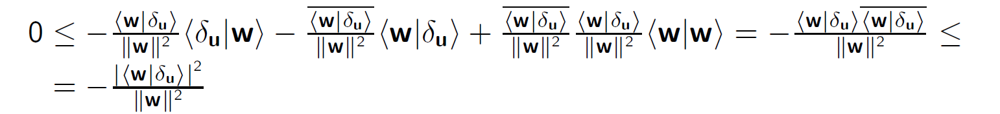

# Aproximace vektoru

## Aproximace

- nepotřebujeme skoro nikdy znát vektory úplně přesně, můžeme uvažovaný vektor nahradit jiným, kterýá je k němu dostatečně blízko a práce s ním je jednodušší
- Na prostorech se skalárním součinem je zavedena velikost vektoru => můžeme přesně definovat "dostatečně blízko"
  - uvažovaný vektor _u_ se od náhradního vektoru _uV_ liší o velmi malý vektor _u_ = *uv ⊕ *δu*, ||*δu*||≤dané *ε\*
  - Náhradní vektor _uV_ hledáme zpravidla v nějakém konečněrozměrném prostoru _V_ daného prostoru _U_
- Předpokládejme *V*⊂*U*, ve kterém hledáme _uv_, je pevně daný
- nejlepší přiblížení _u_ z prostoru _U_ vektorem z _V_ bude takový vektor _uV_, který bude splňovat: **||_u_ ⊕ (-_uv_)||≤||_u_ ⊕ (-_v_)||** pro ∀ _v_ ∈ _V_
- Označíme _δu_ = _u_ ⊕ (-_uV_), a protože vektorry _uV_ i _v_ jsou v prostoru _V_ existuje _w_ ∈ _V_ tak, že _uV_ = _v_ ⊕ _w_
- Požadavek optimality: ||_δu_|| ≤ ||_u_ ⊕ (-_uV_) ⊕ _uV_ ⊕ (-_v_)|| = ||_δu_ ⊕ _w_|| pro každý vektor _w_ z prostoru _V_

### Vlastnost odchylky

- Podmíka optimality je nerovnost mezi dvěma nezápornými čísly
- umocníme podmínku optimality na druhou a dostamene:
  - ||_δu_||2 ≤ ||_δu_ ⊕ _w_||2 = ⟨_δu_ ⊕ _w_|_δu_ ⊕ _w_⟩ = ⟨_δu_|_δu_⟩ + ⟨_δu_|_w_⟩ + ⟨_w_|_δu_⟩ + ⟨_w_|_w_⟩
  - 0 = ⟨_δu_|_w_⟩ + ⟨_w_|_δu_⟩ + ⟨_w_|_w_⟩
- Tento vztah musíplatit pro každý nenulový vektor _w_ z podprostoru _V_ (pro _w_ = _o_ platí triviálně), tedy i pro vektor w' = -⟨_w_|_δu_⟩/||_w_||2 ⊗ _w_
  - 
- Má-li být splněna podmínka 0 ≤ - |⟨_w_|_δu_⟩|2/||_w_||2 pro všechny _w_ z _V_ musí být ⟨_w_|_δu_⟩ = 0

  - tedy _δu_ musí být kolmý na všechny vektory z prostoru _V_
  - 
  - Hledané nejlepší přiblížení vektoru _u_ vektorem _uV_ z prostroru _V_ proto také charakterizujeme jako kolmý průnět vektoru _u_ so prostoru _V_.

- Je-li _U_ vektortový prostor se skalárním součinem, _V_ ⊂ _U_ jeho úplný podprostor a vektor _u_ ∈ _U_, pak existuje právě jeden vektor _uV_ ∈ _V_ takový, že ||_u_ ⊕ (-_uV_)|| ≤ ||_u_ ⊕ (-_v_)|| pro všechny _v_ ∈ _V_
- Pokud najdeme jeden vektor _uV_ takový, že optimálně aproximuje vektor _u_ na podprostoru _V_, můžeme pro libovolný vektor _v_ ∈ _V_ vyjádřit vektor _uV_ jako součet *uV = *v* ⊕ *w* pro nějaké *w* ∈ *V\*
- 
- a protože _uV_ je ⟨_w_|_δu_⟩ = 0 pro všechny vektory _w_ z podprostoru _V_ je
- 
- pro všechny _w_ ≠ _o_, a tedy nalezené optimální přiblížení je jediné

Pokud je podprostor _V_ konečněrozměrný, můžeme v něm najít bazi _G_ = {**g**j}j=1n a hledaný vektor _uV_ popsat jeho souřadnicemi _uj_ v této bazi

- pro všechny vektory _w_ ∈ _V_ musí platit speciálně i pro vektory _w_ = **g**_i_ ∈ _V_ tedy

- pro všechny vektory **g**_i_ ∈ _G_

## Soustava rovnic a přímý výpočet

- soustava _n_ rovnic pro _n_ neznámých součadnic _uj_ s metrickou maticí **G** generovanou množinou _G_
- Je-li baze _G_ ortogonální jsou všechny prvky matice **G** s vyjímkou těch diagonálních nulové, a vyjde

- kdyby existovala ortogonální bsze celého _U_ a _V_ by byl lineárním obalem jejích prvních _n_ vektorů, dostaneme hledané optimální přiblížení pomocí prvních _n_ souřadnic vektoru _u_ v bazi _G_

### výpočet velikosti aproximace

- známe-li už souřadnice _ui_ hledaného přiblížení v bazi _G_, známe i toto přiblížení a můžeme spočítat
- 
- což je druhá mocnina normy souřadnicového vektoru **u**(_g_) při skalárním součinu s metrikou **G**
- V případě, že je baze _G_ podprostoru _V_ ortogonální, můžeme souřadnice _uj_ spočítat přímo a
- 

### Rozšiřování aproximačnéího podprostoru
- Uvažujme posloupnost vektorů (_ai_)*i*≥1 z unitárního prostoru _U_ a posloupnost podprostotů _Vj_ = span{_ai_}_i_=1j
  - Pro každé přirozené j < (počet vektorů v posloupnosti (*au)) je *Vj* ⊂ *V**j*+1
  - Z posloupnosti (*ai*) odstraníme všechny vektory které jsou leneárními kombinacemi předcházejících členů této posloupnosti, dostaneme tak lineárně nezávislou množinu *A'*={*a'i*}*i*≥1 a odpovídající posloupnost podprostorů *V'j* = span{*a'i*}*i*≥1j
  - Ortogonalizací množiny *A'* dostaneme ortogonální množinu *G*={**g***i*}*i*≥1
    - Každá množina *G**j* = {**g***i*}*i*≥1j bude ortogonální bazí odpovídajícího podprostoru *V'j*

### Pokles velikosti chyby

- rozšiřováním aproximačního podprostoru *V* se aproximace vektoru *u* zpravidla zlepšují, nikdy se nemohou zhoršit

## Metoda nejmenších čtverců
