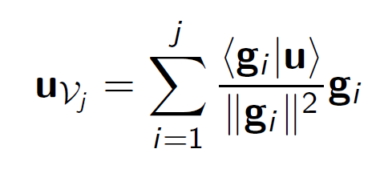
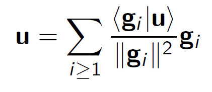

# Fourierovy řady
- Přiblížení vektoru **u** v podprostoru *Vj* je dáno vztahem

- odchylku **u** - **u***Vj* lze libovolně zmenšit (volbou dostatečně velkého *j*)

- Tento vztah se nazývá Fourierovou řadou vektoru **u** v ortogonální bazi *G* a souřadnice *ui se označují jako Fourierovy koeficienty vektoru **u** v bazi *G*

### Trigonometrická baze
Systém funkcí:
- *c*0=1, *c**k*=cos(*k*x), *s**k*=sin(*k*x), pro *k* ∈ *N*
- tvoří ortogonální bazi prostoru *L*2(-π;π) (a i libovolného prostoru *L*2(a;a+2π) pro a ∈ *ℝ*) Druhé mocniny norem těchto funkcí jsou:
  - ||*c*0||2 = 2π, ||*c**k*||2 = ||*s**k*||2 = π pro *k* ∈ *N*