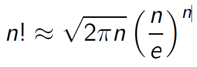
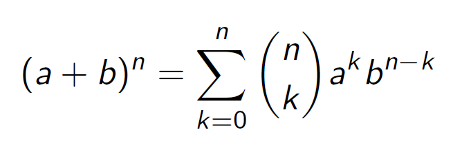

# Kombinatorika

- Množiny _A_, _B_ nazveme ekvivalentní (_A_~_B_), pokud prosté existuje zobrazení _e_ množiny A na množinu B (_D(e)_ = _A_, _W(e)_ = _B_)
- Pro ekvivalentní množiny je |_A_| = |_B_|

## Základní pravidla kombinatoriky

### Pravidlo součinu

- Jsou-li _A_, _B_ libovolné množiny, pak pro množinu všech uspořádaných dvojic </br>
  *A*×*B* = {(_a_,_b_) : _a_ ∈ _A_, _b_ ∈ _B_} platí </br>
  |_A_ × _B_| = |_A_| × |_B_|
- Pravidlo má smyslo pro konečné množiny _A_, _B_
- Je-li jedna z množin nekonečná, výsledek násobení je také nekonečný, s vyjímkou případu, kdy je druhá množina prázdná

### Pravidlo součtu

- Jsou-li _A_<sub>1</sub>, _A_<sub>2</sub>, ... _A_<sub>n</sub> navzájem disjunktní množiny (nemají nic společného) pak platí :


- pravidlo má smysl pouze pro konečné množiny _A<sub>i</sub>_
- Je-li některá množina nekonečná, výsledek je nekonečný

### Dirichletův princip

- Jsou-li _A_<sub>1</sub>, _A_<sub>2</sub>, ... _A_<sub>n</sub> navzájem disjunktní množiny a jejich sjednocení má celkem _k_ prvků, pak existuje množina _A<sub>i</sub>_ (1 ≤ _i_ ≤ _n_) taková, že </br>
   <br>
  kde symbol [*x*] znamená celou část čísla _x_, tedy největší celé číslo, které nepřesahuje hodnotu _x_
  (například [2] = 2, [2,99] = 2)

Sjednocení nedisjunktních množin <br>

### Princip inkluze a exkluze

Porovnáním levé a pravé strany posledního vztahu dostaneme princip inkluze a exkluze pro dvojici množin <br> |_A_ ∪ _B_| = |_A_| + |_B_| − |_A_ ∩ _B_| <br>

- mějme množiny _A_, _B_, _C_
- pokud je jedna prázdná dostaneme princip inkluze a exkluze pro dvojici množin
- Princip inkluze a exkluze, by tedy měl obsahovat stejné výrazy jako pro dvojici množin<br>|*A*∪*B*∪*C*| = |_A_|+|_B_|+|_C_|−|*A*∩*B*|−|*A*∩*C*|−|*B*∩*C*|
- Prvky sjednocení 3 množin můžeme rozdělit do (celkem 7) disjunktních množin tří typů:
  - prvky, které jsou v jedné z množin a nejsou ve zbývajících dvou
  - prvky, které jsou ve dvou z množin a ve třetí ne
  - prvky, které jsou ve všech třech množinách
- prvky prvního typu započítáme v navrženém vzorci jen jednou, prvky druhého typu započítáme dvakrát v jejich základních množinách a pak je jednou odečteme v rámci příslušných průniků, celkem tedy budou ve výsleku také v jednom exempláři
- Prvky z průniku všech tří množin sice třikrát přičteme, ale potom je také třikrát odečteme. V původním návrhu se tedy ztratili a musíme je ještě přidat <br> |*A*∪*B*∪*C*| = |_A_|+|_B_|+|_C_|−|*A*∩*B*|−|*A*∩*C*|−|*B*∩*C*|+|*A*∩*B*∩*C*|
- Tento výsledek nás může inspirovt k tomu jak bude vypadat počet prvků sjednocení obecného počtu _n_ množin
- Je vidět:
  - velikost původních množin přičítáme
  - velikost průniků dvojic odečítáme
  - zdá se, že velikost průniků trojic množin budeme přičítat
- Velikost všech průniků lichého počtu množin budeme přičítat a velikosti sudého počtu množin budeme odečítat
- Princip inkluze a exkluze pro libovolný počet množin <br> 

## Kombinatorické výpočty

### Faktoriál

- přibližný výpočet: Stirlingův vzorec <br> 

### Permutace

Uvažujeme množinu _M_ o _n_ prvcích (|_M_| = _n_)

- Bez opakování
  - Permutací _n_ prvků bez opakování (nebo také permutací řádu _n_) nazýváme každou uspořádanou _n_-tici **navzájem různých** prvků množiny _M_.
  - Permutace považujeme za různé pokud se liší alespoň na jednom místě
  - Počet všech permutací řádu _n_ je _P_(_n_) = _n_!
- S opakováním
  - Je-li _M_={_m_<sub>1</sub>, _m_<sub>2</sub>, ..., _m_<sub>n</sub>} _n_-prvková množina a _k_<sub>1</sub>, _k_<sub>2</sub>, ..., _k_<sub>n</sub> přirozená čísla, nazveme každou uspořádanou (_k_<sub>1</sub> + _k_<sub>2</sub> + ⋅⋅⋅ + _k_<sub>n</sub>)-tici prvků z _M_, která obsahuje každý prvek _m<sub>j</sub>_ právě _k<sub>j</sub>_-krát, permutací _n_ prvků s opakováním řádu (_k_<sub>1</sub>, _k_<sub>2</sub>, ..., _k_<sub>n</sub>)
  - Například: _M_= {_a_, _b_, _c_}, _k_<sub>1</sub> = 2, _k_<sub>2</sub> = 4, _k_<sub>3</sub> = 1, permutací uvedeného typu může být (_b_,_a_,_b_,_b_,_c_,_a_,_b_)
  - Počet všech permutací s opakováním řádu (_k_<sub>1</sub>, _k_<sub>2</sub>, ..., _k_<sub>n</sub>) značíme _P_(_k_<sub>1</sub>, _k_<sub>2</sub>, ..., _k_<sub>n</sub>), nebo také _P_<sub>_k_<sub>1</sub>, _k_<sub>2</sub>, ..., _k_<sub>n</sub></sub> <br> 

### Variace

Uvažujeme množinu _M_ o _n_ prvcích (|_M_| = _n_)

- Bez opakování
  - Varicí _k_-té třídy z _n_ prvků bez opakování nazýváme každou uspořádanou _k_-tici _navzájem různých_ prvků množiny _M_
  - Za různé se považují takové variace, které se liší alespoň na jedné pozici
    - Parmutace řádu _n_ jsou tedy speciálním případem variací bez opakování - variace _n_-té třídy z _n_ prvků
  - Počet všech variací _k_-té třídy z _n_ prvků bez opakování je <br> 
  - Na první pozici můžeme umísti libovolný z _n_ prvků, na druhou už zbývá o jeden méně, tedy _n_ - , na každou dalšá zase o jeden méně, ... <br>a protože vytváříme *k*tice, měly by se jednotlivé příspěvky vynásobit
  - Každou variaci, která obsahuje daných _k_ prvků množiny _M_, můžeme doplnit na dalších místech libovolnou permutací zbývajících _n_ - _k_ prvků. Tím dostaneme nějakou permutaci z _n_ prvků. Dodatkových permutací ke každé možné variaci je vždy (_n_ - _k_)!
  - Protože všechny takto vytvořené variace z _n_ prvků jsou různé a každou permutaci z _n_ prvků můžeme zapsat jako variaci _k_-té třídy z _n_ prvků bez opakování + permutaci za zbývajících (_n_ - _k_) prvků, bude <br> 
- S opakováním
  - Variací _k_-té třídy z _n_ prvků s opakováním nazýváme každou uspořádanou _k_-tici prvků z množiny _M_
  - Počet všech variací _k_-té třídy z _n_ prvků s opakováním je <br> 

### Kombinace

Uvažujeme množinu _M_ o _n_ prvcích (|_M_| = _n_)

- Bez opakování
  - Kombinací _k_-té třídy z _n_ prvků bez opakování nazýváme každou neuspořádanou _k_-tici (navzájem různých) prvků množiny _M_
  - Dvě kombinace považujeme za rozdílné pokud se liší ve výskytu některého prvku
  - Tato hodnota se nazývá kombinační číslo <br> 
- S opakováním
  - Kombinací _k_-té třídy z _n_ prvků s opakováním nazýváme každou neuspořádanou _k_-tici prvků množiny _M_, které se mohou vyskytovat v **libovolném množství exemplářů** (ne větším než _k_)
  - Dvě kombinace považujeme za různé, pokud se liší v počtu exemplářů některého prvku
  - Počet kombinací s opakováním dostaneme jako počet možných umístění (_n_ - 1) oddělovačů na (_n_ + _k_ - 1) pozic v rozšířené množině => bude jich tolik kolik můžeme vybrat (_n_ - 1)-prvkových podmnožin z (_n_ + _k_ -1)-prvkové množiny: <br> 

### Pascalův trojúhelník

- kombinační čícla můžeme srovnat do tabulky

```
 n\k| 0   1   2   3   4   5   6
---------------------------------
  0 | 1   0   0   0   0   0   0
  1 | 1   1   0   0   0   0   0
  2 | 1   2   1   0   0   0   0
  3 | 1   3   3   1   0   0   0
  4 | 1   4   6   4   1   0   0
  5 | 1   5   10  10  5   1   0
  6 | 1   6   15  20  15  6   1
```


### Kombinatorické identity
- Vandermondova identita <br> 

### Binomická věta
- standardní tvar mnohočlenu: *P*(x) = ∑a<sub>j</sub>x<sup>j<sup>
- Budeme se teď snažit převést do podobného tvaru výraz: <br> (a + b)<sup>n</sup> = ∑α<sub>jk></sub>a<sup>j</sup>b<sup>k</sup><br> roli proměnné x může hrát třeba symbol b
- Výsledek bude tvořený součtem součinů symbolů a a b a v každém ze součinu bude součet výskytů symbolu a a symbolu b roven n <br> 
  - hodnota c<sub>k</sub> popisuje kolika způsoby se dá uvažovaný součin a<sup>k</sup>b<sup>n-k</sup> vytvořit
  - Postupujeme tak, že vytváříme uspořádané n-tice tvořené symboly dvou druhů, první z nich se vyskytuje k-krát a druhý (n-k)-krát <br> 

Vásledek: <br> 
- Kombinační čísla se v této souvislosti označují jako binomické koeficienty

### Zobecněná kombinační čísla
- pro kombinační čísla není stanoveno omezení pro n
- můžeme tedy za n dosadit libovolné reálné r
- za k stále nezáporné celé číslo
- "Prázdný součin" k=0 definujeme jako 1 <br> 
- Lze tedy spočítat i hodnoty (n nad k) pro celá záporná n 
  - Rozšířený pascalův trojúhelník:
```
 n\k| 0   1   2   3   4   5   6
---------------------------------
 -3 | 1  -3   6  -10  15 -21  28
 -2 | 1  -2   3  -4   5  -6   7
 -1 | 1  -1   1  -1   1  -1   1 
  0 | 1   0   0   0   0   0   0
  1 | 1   1   0   0   0   0   0
  2 | 1   2   1   0   0   0   0
  3 | 1   3   3   1   0   0   0
  4 | 1   4   6   4   1   0   0
  5 | 1   5   10  10  5   1   0
  6 | 1   6   15  20  15  6   1
``` 

- Newtonův vzorec <br> 
  - pro libovolné reálné r, pro které existujípotřebné hodnoty b<sup>r-k</sup>, a každé x, pro které |x| < |b|
  - Při práci s tímto vzorcem nesčítáme celou nekonečnou řadu, ale vytváříme její částečné součty<br>
