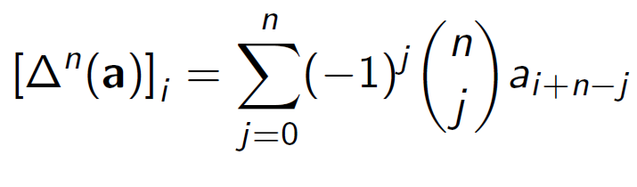
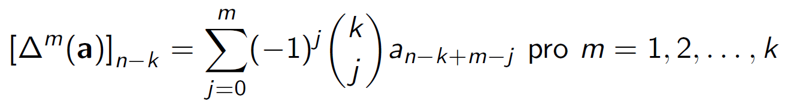
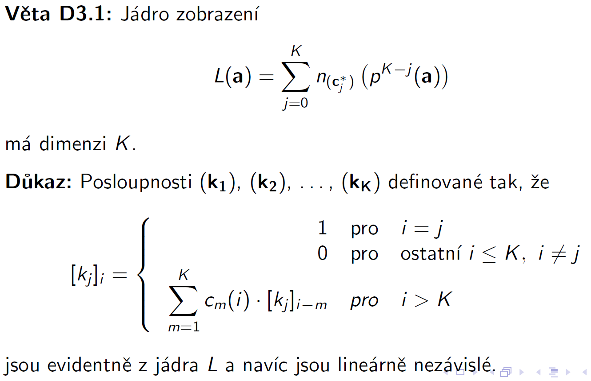

# Posloupnosti

Posloupnost (**a**) = (_a_1, _a_2, ... _a_n[,...]) je zobrazení z množiny přirozených čísel do dané množiny _M_. Prvek _a_j ∈ _M_ je obrazem čísla _j_ ∈ _N_ a nazýváme ho _j_-tým členem posloupnosti.

- vyžadujeme, aby nebyly díry => s každým číslem _n_ ∈ _N_ posloupnost obsahovala i _n_ - 1 (pokud _n_ ≠ 1)
  - _D_(**a**) = {1, 2, ..., _n_} - konečná _n_-prvková posloupnost
    - _n_-prvkové číselné posloupnosti jsou uspořádané _n_-tice čísel z dané množiny _M_
    - pokud je množina _M_ tělesem, jsou _n_-prvkové číselné posloupnosti vektory v _Mn_
  - _D_(**a**) = _N_ - nekonečná posloupnost
    - očekáváme, že budeme schopni určit jakýkoli _n_-tý člen \*an
      - nalezení přímého vztahu: _an_ = _f_(_n_) - explicitně výjádřený člen
    - O posloupnosti (_ai_)*i*≥1 řekneme, že je definovaná rekurentně, pokud _ak_ = _f_(_k_, _a_1, _a_2, . . . , _a_*k*−1) pro každé _k_ > _n_0. Konečnou část posloupnosti (_ai_)_i_=1_n_0, pro kterou platnost neočekáváme, pak můžeme definovat výčtem hodnot _a_1, _a_2, ..., _a__n_0. => počáteční podmínky
      - (**a**): _aj_ = 1 => rekurentně:  _a_1 = 1, _an_ = _a__n_-1 pro _n_ > 1
      - (**a**): _an_ = _n_! =>   _a_1 = 1, _an_ = *n*×*a*_n_-1 pro _n_ > 1
    - Sčítání posloupností z tělesa _T_ (vektory z *Tn): (**a**) = (*ai*)*i*≥1 a (**b**) = (*bi*)*i*≥1 => (**c**) = (**a**) ⊕ (**b**) = (*ci* = *ai* + *bi*)*i\*≥1
    - Pro číslo α ∈ _T_ α-násobek posloupnosti: (**c**) = α ⊗ (**a**) = (_ci_ = α × _ai_)*i*≥1
    - Množina všech posloupností s takto definovaným sčítáním a násobením tvoří vektorový prostor _S_(_T_) nad tělesem _T_
    - V prostoru nekonečných posloupností lze provádět běžné operace, vytvářet lineární kombinace posloupností, uvažovat o lineárích obalech daných množin a jejich lineární (ne)závislost
    - Je snadné vytvořit nekonečně velkou lineárně nezávislou množinu, ale nepodaří se nám najít množinu v jsjíž lineárním obalu by byly všechny nekonečné posloupnosti - u lineárních kombinací požadujeme **konečný** počet násobků daných vektorů => prostor nekonečných posloupností **ne**má bazi

Zobrazení v posloupnostech

- budou nás nejvíce zajímat zobrazení do jiných vektorových prostorů
- například: _vM_ : _S_(_T_) → _Tn_, které pro danou _n_-tici přirozených čísel _M_ přiřazuje posloupnosti (**a**) _n_-tici hodnot členů posloupnosti _vM_(**a**) => lineární zobrazení
- Užitečná jsou i zobrazení nekonečných prostorů do sebe
  - Je-li (**c**) = (_ci_)*i*≥1 ∈ _S_(_T_) pevně daná posloupnost => _n_(**c**) : _S_(_T_) → _S_(_T_) definované tak, že _n_(**c**)(**a**) = (**d**) = (_ci_ · _ai_)*i*≥1 je lineární
- V matematické analýze je významným zobrazením _S_(_T_) → _T_ částečný součet posloupnosti sn(**a**) = ∑*ai* a zobrazení _s_, které posloupnosti (**a**) přiřazuje posloupnost (**s**) = _s_(**a**) jejích částečných součtů *si = ∑*aj\* Obě tato zobrazení jsou také lineární
- posunutí posloupnosti ("zpětné") - (**b**) = _p_(**a**) takž, že *bi = *a**i\*+1 => lineární zobrazení
- "dopředné" posunutí => není zobrazení, protože nedefinuje prvek _b_1, při doplnění hodnoty _b_1 bychom dostali zobrazení, ale není lineární
  - Lineární zobrazení bychom dostali, kdyby _b_1 bylo lineární kombinací prvků z (**a**), třeba _b_1 = 0

Diference

- Δ(**a**) = _p_(**a**) - (**a**) takže [Δ(**a**)]_i_ = _a__i_+1 - _ai_ je rozdíl sousedních prvků posloupnosti
- Diference je lineární kombinací lineárních zobrazení, a proto je také lineární
- Protože Δ: _S_(_T_) → _S_(_T_), můžeme vytvářet její mocniny, které se nazývají diferencemi _k_-tého řátu   Δ2(**a**) = Δ(Δ(**a**)) [Δ2(**a**)]_i_ = [Δ(**a**)]_i_+1 - [Δ(**a**)]_i_ = _a__i_+2 - _a__i_+1 - (_a__i_+1 - _a__i_) = _a__i_+2 -2*a*_i_+1 + _a__i_   a matematickou indukcí lze podle Pascalovy identity dokázat:   

Rekurentnost

- O posloupnosti (**a**) řekneme, že je definována rekurentním vztahem *k*tého řádu, pokud _an_ = _f_(_n_,_a__n_-1, _a__n_-2, ..., _a__n_-_k_) pro každé _n_ > _k_
  - Tento rekurentní vztah se nedá použít pro výpočet hodnoty _ai_ pro _i_ = 1, 2, ..., _k_. Těchto _k_ počátečních podmínek musíme zadat přímým výčtem
- V systému vztahů  můžeme pomocí diferencí [Δ*m*(**a**)]_n_-_k_ a hodnoty _a__n_-_k_ vyjádřit všechny členy _a__n_-_k_+1, _a__n_-_k_+2</dub>, ..., _an_ a dosafit za ně do rekurentní definice _k_-tého řádu a dostaneme vztah  g* (*n*, *a**n*-*k*, [Δ1(**a**)]*n*-*k*,...,[Δ*k*(**a**)]*n*-*k*) = g(*n*, *a**n*, [Δ1(**a**)]*n*,...,[Δ*k*(**a**)]*n*) = 0 který nazýváme diferenční rovnicí *k\*-tého řádu
- Je-li v rekurentním vztahu *k*tého řádu _an_ = _f_(_n_,_a__n_-1, _a__n_-2,...,_a__n_-_k_) funkce _f_ lineární funkcí parametrů _aj_ pro _j_ = _n_-_k_,_n_-_k_+1,...,_n_-1 f*(*n*,*a**n*-1, *a**n*-2,...,*a**n*-*k*) = ∑*cj*(*n*)*a**n*-*j*+*b*(*n*) kde *b*(n), *cj*(*n*) jsou libovolné funkce pořadového čísla *n*, nazýváme vztah *an* = ∑*cj*(*n*)*a**n*-*j* + *b*(*n*) lineárním rekurentním vztahem řádu *k\*
  - navíc požadujeme, aby funkce _ck_(_n_) nebyla identicky nulová
- definujeme posloupnosti (**b\***), (**cj**\*) pro _j_ = 1,2,...,_k_ tak, že _bi_\* = _b_(_i_+_k_), (_cj_\*)_i_ = _cj_(_i_+_k_) a využijeme podunutí posloupnosti (**a**), můžeme v definici lineárního rekurentního vstahu psát ∑*n*(**c**_j_\*)(p_k_-_j_(**a**)) = -(**b**\*) kde _n_(**c**_j_\*) je zobrazení násobení posloupností (**c**_j_\*) a doplněná posloupnost (**c**0\*) je konstantní, (_c_0\*)_j_ = -1 pro každé _j_ ∈ _N_
- Klíčovou roli hraje (lineární) zobrazení   _L_(**a**) = ∑*n*(**c**_j_\*)(p_k_-_j_(**a**)) Formulace úlohy v podobě _L_(**a**) = -**b**\* má tu přednost, že v příznivých případech dovoluje najít explicitní vyjádření členů posloupnosti (**a**).
  - To nazýváme řešením rekurentního vztahu
  - Pro nelineární rekurentní vztahy je taková úloha řešitelná zcela výjimečně
  - Řešení a jeho vlastnosti pro známý vektor (**b**\*) a neznámý vektor (**a**) popisuje Frobeniova věta
  - Odpověď na otázku, jestl je (**b**\*) ∈ _W_(_L_), je kladná a triviálně vyplývá z původní rekurence
- Dalším krokem je nalezení jádra zobrazení _L_ tedy řešení homogenní rovnice _L_(**a**) = (**0**)
- 

[Kombinatorika ⬅️](./16_Kombinatorika.md) | [➡️ Grafy](./18_Grafy.md)
