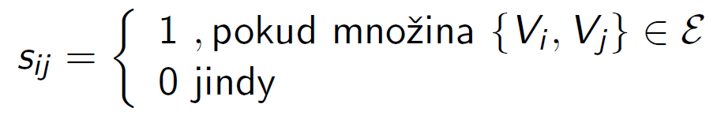
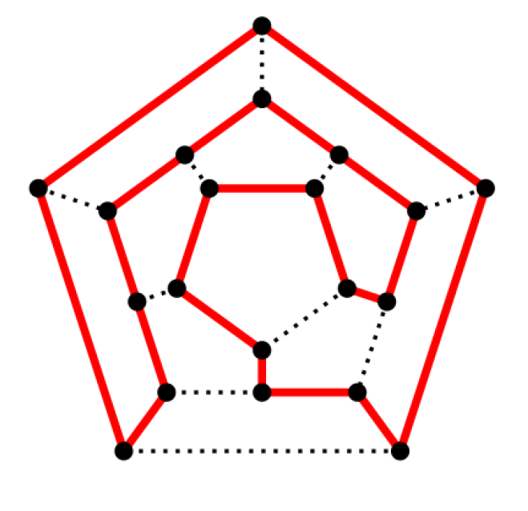

# Teorie grafů

## Grafy

- Grafem nazýváme dvojici množin _G_ = (_V_,_E_) takových, že
  - množina _V_={V1,V2, . . . ,Vn} je konečná
  - prvky množiny _E_ jsou (ne nutně všechny) dvojprvkové podmnožiny _eij_ = {_Vi_,_Vj_ ⊂ _V_}
  - Prvky množiny _V_ nazýváme vrcholy grafu _G_
  - Prvky množiny _E_ nazýváme hrany grafu _G_
  - Je-li _eij_ = {_Vi_ ,_Vj_}, řekneme, že hrana _eij_ je incidentní s vrcholem _Vi_ a vrchol _Vi_ je incidentní s hranou _eij_. Totéž se týká vrcholu _Vj_.
  - Příklady:
    - _Nulový_ graf obsahuje pouze vrcholy, ale žádnou hranu
    - _Triviální_ graf obsahuje jediný vrchol a tedy žádnou hranu
    - Prázdný graf neobsahuje ani vrcholy

### Matice sousednosti

- matice **S** pro kterou: 
- Matice sousednosti normálního grafu je symetrická

### Multigraf

- Multigrafem nazýváme dvojici _G_ = (_V_,_E_) takovou, že
  - _V_={V1,V2, . . . ,Vn} je konečná množina vrcholů
  - _E_ je **posloupnost** dvouprvkových podmnožin (_Vi_,_Vj_)⊂*V* (hran)
    - V posloupnosti hran se některé podmnožiny mohou opakovat

### Orientovaný graf

- Orientovaným grafem nazýváme dvojici množin _G_ = (_V_,_E_) takových, že
  - Množina _V_={V1,V2, . . . ,Vn} je konečná
  - prvky množiny _E_ jsou **uspořádané** dvojice _eij_ = (_Vi_,_Vj_) různých prvků z _V_

### Pseudograf

- Pseudografem nazýváme dvojici _G_ = (_V_,_E_) takových, že
  - Množina _V_={V1,V2, . . . ,Vn} je konečná
  - prvky množiny _E_ jsou dvojice _eij_ = (_Vi_,_Vj_) prvků z _V_
    - Může obsahovat spojnici vrcholu se sebou samým => smyčka

### Hranově a Vrcholově ohraničený graf

- Hranově ohodnoceným grafem nazýváme graf _G_ = (_V_,_E_) takový, že každé hraně _eij_ ∈ _E_ je přiřazeno číselné ohodnocení _hij_
- Vrcholově ohodnoceným grafem nazýváme graf _G_ = (_V_,_E_) takový, že každému vrcholu _V_i* ∈ *V* je přiřazeno číselné ohodnocení *vi\*
- Ohodnocení bývají kladná

### Izomorfní graf

- Grafy _G_1 = (_U_,_E_) a _G_2 = (_V_,_F_) nazveme izomorfní, pokud existuje prosté zobrazení _i_: *U*→*V*, _D_(_i_) = _U_, _W_(i) = _V_ takové, že hrana (_Uj_,*Uk) ∈ *E*, právě když hrana (*i*(*Uj*),*i*(*Uk)) ∈ _F_
- Izomorfní grafy jsou rovnocenné

### Podgraf

- Graf _G'_ = (_V'_,_E'_) nazveme podgrafem grafu _G_ = (_V_,_E_), pokud _V'_ ⊂ _V_ a _E'_ ⊂ _E_. Píšeme _G'_ ⊂ _G_
- _E'_ nemůže obsahovat hrany, které jsou incidentní s vrcholy v _V'_
- Je-li graf _G'_ = (_V_,_E'_) ⊂ _G_ = (_V_,_E_), řekneme, že _G'_ vznikl odebráním hran z množiny \*E\** ⊂ *E\*
- Je-li graf _G'_ = (_V'_,_E'_) ⊂ _G_ = (_V_,_E_), takový, že všechny hrany z _E_\\_E'_ incidují s vrcholy z _V_\\_V'_ řekneme, že _G'_ vznikl z _G_ odebráním vrcholů \*V\** ⊂ *V\*

### Úplný graf

- má _n_ vrcholů
- množina jeho hran obsahuje všechny přípustné dvojice, jejich počet je |_E_| = _n_ nad 2

### Bipartitní graf

- množinu vrcholů _V_ lze rozdělit na disjunktní části _U_, _W_ tak, že má pouze hrany pouze hrany _eij_ = (_Ui_ ,_Wj_ ), *Ui ∈ *U*, *Wj* ∈ *W\*.

### Úplný bipartitní graf

- bipartitní graf pro který |_U_| = _m_, |_W_| = _n_ a množina jeho hran obsahuje všechny přípustné dvojice vrcholů
  - jeho počet hran je |_E_| = _mn_

## Sled v grafu

- Sled v grafu _G_ = (_V_,_E_) je taková posloupnost vrcholů a hran (_v_0,_e_1,_v_1,_e_2,_v_2,...,_es_,_vs_), že kařdá hrana _ej_ = (_v__j_-1,_vj_)

## Tah v grafu

- Tah v grafu _G_ = (_V_,_E_) je takový sled, který obsahuje každou hranu z _E_ nejvýše jednou

## Eulerovský graf

- Eulerovský tah
  - tah v grafu, který obsahuje každou hranu grafu právě jednou
  - Každý vrchol s vyjímkou prvního a posledního je incidentní se dvěma přilehlými hranami
  - Při vícenásobném výskytu vrcholu je celkový počet hran, které jsou v tahu s daným vrcholem incidentní, sudý (hrany se v grafu neopakují)
- Uzavřený eulerovký tah
  - tah v grafu, jehož koncový vrchol splývá s počátečním
- Eulerovský graf
  - graf, ve kterém existuje uzavřený eulerovský tah
- V grafu _G'_ = (_V_,_E_) existuje eulerovský tah pouze v případě, že nejvýše dva jeho vrcholy mají liché stupně
- Graf _G'_ = (_V_,_E_) je eulerovský, právě když mají všechny jeho vrcholy sudé stupně

## Cesta

- Cesta v grafu _G_ = (_V_,_E_) je takový tah, který obsahuje každý vrchol z _V_ nejvýše jednou
  - Cesta z prvního vrcholu do posledního

## Kružnice

- Kružnice v grafu _G_ = (_V_,_E_) je takový tah, který obsahuje každý vrchol z _V_ nejvýše jednou, s vyjímkou prvního a posledního vrcholu, které jsou totožné

## Souvislý graf

- Graf _G_ = (_V_,_E_) je souvislý, pokud v něm pro každé dva vrcholy _u_, _v_ exiszuje sled (_u_,_e_1,_v_1,_e_2,...,_v_)
- Má-li graf _n_ vrcholů a existuje sled (_u_,_e_1,_v_1,_e_2,...,_v_), pak také existuje jiný sled (_u_,_e'_1,_v'_1,_e'_2,...,_v_), který má nejvýše _n_ - 1 hran

## Cyklický graf

- Graf _G_ = (_V_,_E_) je cyklický, pokud v něm existuje kružnice
- Graf _G_ = (_V_,_E_) ve kterém kružnice neexistuje se nazývá acyklický
- Hrana v grafu, která není obsažena v žádné kružnici, se nazývá acyklická hrana, nebo také most
- Souvislý acyklický graf se nazývá strom
- Má-li strom _n_ vrcholů, pak má _n_ - 1 hran
- Hamiltonovou kružnicí v grafu _G_ = (_V_,_E_) nazveme takovou kružnici, která prochází všemi jeho vrcholy.
- Graf _G_ = (_V_,_E_) je hamiltonovský, pokud v něm existuje hamiltonovká kružnice 

## Kostra grafu

- Kostrou grafu _G_ = (_V_,_E_) nazýváme libovolný podgraf _G'_ = (_V_,_E'_) ⊂ _G_ který je stromem
- Množina vrcholů kostry obsahuje všechny vrcholy grafu

## Postupy Tvorby

### Kontarkce hrany

- Jsou-li grafy _G_ = (_V_,_E_) a _H_ = (_U_,_F_) a _eij_ = (_Vi_ ,_Vj_) ∈ _E_ řekneme, že graf _H_ vznikl z grafu _G_ kontrakcí hrany _eij_, když:
  - _U_ = _V_\\{_Vi_ ,_Vj_} ∪ {_W_}, přičemž *W*∉*V*
  - množina hran _F_ je tvořena
    - Všemi hranami z _E_, které nejsou incidentní ani s _Vi_ , ani s _Vj_
    - A hranami (_W_, _Vk_) pro všechny vrcholy _Vk_ ∈ _U_, pro které je (_Vk_, _Vi_) ∈ _E_ nebo (_Vk_, _Vj_) ∈ _E_

### Sjednocení a průnik grafů

- Jsou-li grafy _G_ = (_V_,_E_) a _H_ = (_U_,_F_), nazveme sjednocením grafů _G_ a _H_ graf   *G*∪*H* = (*V*∪*U*,*E*∪*F*)
- Jsou-li grafy _G_ = (_V_,_E_) a _H_ = (_U_,_F_), nazveme průnikem grafů _G_ a _H_ graf   *G*∩*H* = (*V*∩*U*, *E*∩*F*)
- Oba systémy tvoří skutečné grafy

### Vrcholy

- V grafu _G_ = (_V_,_E_) nazveme stupněm vrcholu V ∈ _V_ počet hran, se kterými je incidentní.
  - Zápis: deg(V) = |{U: {V,U} ∈ _E_}|
  - Příklad: deg(U1) = 2
- V grafu _G_ = (_V_,_E_) je součet všech vrcholů sudý
  - Dúkaz vychází z toho, že každá hrana je incidentní s právě dvěma vrcholy.
  - U pseudografů se smyčky vycházející z vrcholu V do stupně tohoto vrcholu počítají 2×
- V orientovaném grafu _G_ = (_V_,_E_) nazveme vstupním stupněm vrcholu V ∈ _V_ počet hran, které do něj vstupují: deg+(V)=|{U: {V,U} ∈ _E_}|
- V orientovaném grafu _G_ = (_V_,_E_) nazveme výstupním stupněm vrcholu V ∈ _V_ počet hran, které z něj vycházejí: deg-(V)=|{U: {V,U} ∈ _E_}|
- V orientovaných grafech platí: ∑deg+(V) = ∑deg-(V)

### Skóre grafu

- V grafu _G_ = (_V_,_E_) nazveme jeho skórem libovolně uspořádanou posloupnost stupňů jeho vrcholů
  - Záleží jen na hodnotá, ne na uspořádání
  - Izomorfní grafy mají také skóre, opačné tvrzení nemusí platit

Rekonstrukce grafu:

1. Nakreslíme vrcholy, přiřadíme stupně
2. Vybraný vrchol spojíme tolika hranami, kolik je jeho stupeň, s vrcholy, jejichž stupně jsou kladné
3. Ve vybraném vrcholu stupeň anulujeme, v připojených ho snížíme o 1
4. Postup opakujeme pro další vrchol

Havlův algoritmus:

1. Některý z vrcholů s **nejvyšším aktuálním stupněm** spojíme tolika hranami, kolik je jeho stupeň, s vrxholy, **jejichž aktuální stupně jsou největší** (je-li jich dostatečný počet)
2. Ve vybraném vrcholu stupeň anulujeme, v připojených snížíme o 1
3. Pokračujeme krokem 1 pro nové skóre

Graf existuje sosáhneme-li skóre(0,0,...,0). Není-li v některém okamžiku možný krok 1, graf neexistuje

### Konstrukce eulerovkého tahu

1. Najdeme (jeden ze dvou) vrcholů lichého stupně
2. Zbývá-li hrana, zařadíme ji do tahu  nebo vybereme hranu, která není mostem
3. Odstraníme hranu z původního grafu
4. pokračujeme druhým vrcholem odstřaněné hrany

### Nejkratší cesta

- lze zjistit v hranově ohodnocených grafech

Postup: Hledáme nejkratší cestu z _u_ do _v_

1. Přípravné kroky
   1. Výchozímu vrcholu _u_ přiřadíme ohodnocení f(_u_) = 0, všem ostatním vrcholům nedosažitelně velké ohodnocení f(_vj_)
   2. Definujeme množiny použitých a nepoužitých hran a vrcholů, popřípadě množinu zařazených hran. Všechny vrcholy a hrany zařadíme do množiny nepoužitých
2. Hledání
   1. V množině nepoužitých vrcholů vybereme ten vrchol _m_, jehož ohodnocení je nejmenší (v prvník kroku je to vrchol _u_)
   2. pro všechny nepoužité hrany(_m_,_vi_) určíme nová ohodnocení vrcholů [f(*vi*)]_new_ = min([f(*vi*)]_old_ , f(_m_) + _h_(_m_, _vi_))
   3. Vrchol _m_ a všechny hrany, které z něj vycházejí, přeřadíme do použitých
   4. hrany, s jejichž pomocí jmse prchol _vi_ dosáhli minima v bodě 2, přidáme mezi zařazené
      1. pokud [f(*vi*)]_old_ > [f(*vi*)]_new_, odstraníme ze zařazených ty hrany, které předtím incidovaly s vrcholem*vi*
   5. dokud mezi použitými vrcholy není cílový vrchol _v_ pokračujeme krokem 1
   6. Ohodnocení nejkratší cesty určuje ohodnocení cílového vrcholu a zařazené hrany nejkratší cestu

- Popsaný algoritmus také nachází všechny cesty z vrcholu _u_ do vrcholů, které od _u_ nejsou dál než _v_

### Minimální kostra

- odebírací algoritmus Kruskalův
  1. hrany srovnáme sestupně podle ohodnocení, všechny jsou na začátku nepoužité
  2. nepoužitou hranu s nejvyšším ohodnocením:
     - odebereme, pokud je cyklická (v aktuálním grafu)
     - přeřadíme mezi použité, pokud je acyklická
  3. opakujeme tak dlouho, dokud nezbývají nepoužité hrany.
  4. Vytříděné použité hrany jsou množinou hran hlednané minimální kostry grafu
- Borůvkův algoritmus:
  1. Hrany srovnáme do posloupnosti _H_ tak, aby posloupnost jejich ohodnocení byla neklesající
  2. Ke každému vrcholu grafu _G_ najdeme v posloupnosti _H_ první hranu, která je s ním incidentní
  3. Množina _K_ všech takto nalezených hran bude náležet do množiny hran hledané kostry
  4. Graf _G_1 dostaneme z G kontrakcí všech hranm z množiny _K_. Porotže přitom mohou "splynout" některé hrany z původního grafu ponecháme v posloupnosti _H_ vždy jenom tu z nich, která se vyskytuje jako první (dostaneme novou poloupnost hran _H_1)
  5. Pokud má nový graf _G_1 více než jeden vrchol, pokračujeme krokem 2 pro graf _G_1 s posloupností hran _H_1
